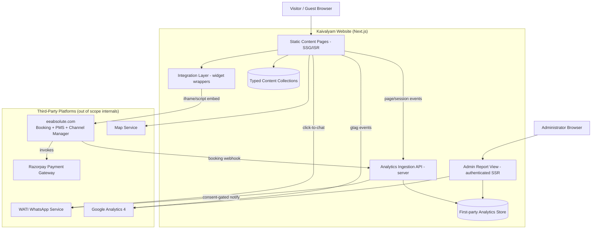
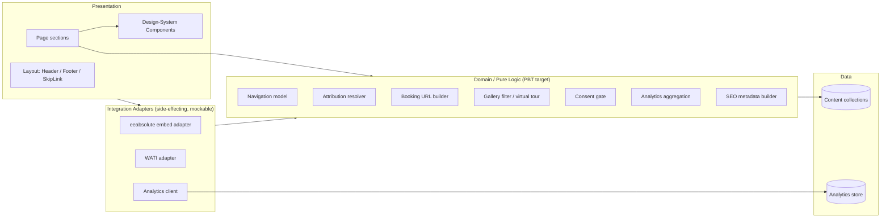
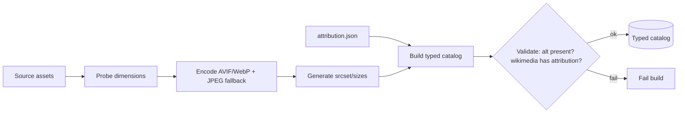

# Design Document

## Overview

The Kaivalyam Homestay Website is a content-rich, image-led marketing-and-booking site for a pet-friendly hill-village homestay in Padichira, Wayanad, Kerala. The site has two jobs: communicate the brand promise of solitude and nature immersion ("EXPERIENCE ULTIMATE SOLITUDE #KAIVALYAM"), and convert visitors into confirmed guests through embedded third-party booking, payment, and messaging integrations.

This design specifies a **statically-generated (SSG/ISR) Next.js application** that pre-renders all marketing content for SEO and speed, embeds the eeabsolute.com booking/PMS/channel-manager widgets and Razorpay through a thin, well-isolated integration layer, wires WATI WhatsApp for both click-to-chat and consent-gated booking notifications, and captures first-party analytics (alongside GA4) surfaced through an authenticated admin report view.

### Design Goals and Rationale

| Goal | Driver | Design Response |
| --- | --- | --- |
| Excellent SEO and fast first paint | Req 20, 21; marketing site discoverability | Static pre-rendering (SSG) + ISR, build-time image optimization, structured data, sitemap/robots |
| Visual quality and brand cohesion | Req 19; brand identity | A documented Design System with logo-derived semantic tokens, one icon family, one primary CTA style |
| Booking conversion without leaving the site | Req 12–15 | Isolated integration layer that embeds eeabsolute widgets with loading/fallback states; Razorpay runs inside that flow |
| Resilient third-party embeds | Req 12.6, 12.7, 7.7 | Loading indicators, error boundaries, and graceful fallbacks (alternate contact path) for every external dependency |
| Accessibility and responsiveness as first-class | Req 18, 22 | Mobile-first system breakpoints, 44×44 targets, focus management, reduced-motion, contrast tokens verified at design time |
| Privacy-respecting analytics | Req 17.7, 16.5 | First-party event capture behind a privacy notice + consent; WATI notifications gated on explicit consent |

### Key Architectural Decisions

- **Decision: Next.js (App Router) with SSG/ISR rather than a SPA or pure SSR.** Content changes rarely, SEO and Core Web Vitals matter, and most pages are static. SSG gives the best performance/SEO profile; ISR allows content (reviews, attractions) to refresh without a full redeploy. SSR is reserved for the authenticated admin report and the analytics ingestion API.
- **Decision: Content lives in typed, version-controlled content collections (TypeScript/MDX + JSON), not a heavy CMS.** The content set is bounded (2 rooms, ~9 facilities, ~68 attractions, a fixed photo catalog) and authored by the build. Typed content gives us compile-time guarantees (every attraction has alt text; every attributed image has credits) that map directly onto our correctness properties.
- **Decision: All booking/PMS/channel-manager/payment functionality is delegated to eeabsolute.com + Razorpay via embeds — we build no booking logic.** Our responsibility is the *embed contract*: correct configuration parameters, loading UX, and fallback. This keeps PCI/booking complexity entirely with the providers.
- **Decision: A first-party analytics pipeline complements GA4.** GA4 covers traffic/sessions/engagement out of the box, but the brief requires a *cumulative visit counter* and *booking billing details* in an *admin report view*. Those need first-party storage and an authenticated UI, so we run a lightweight events endpoint + datastore in addition to GA4.

## Architecture

### System Context



### Rendering Strategy

| Surface | Render mode | Why |
| --- | --- | --- |
| Home, About, Rooms, Facilities, Cuisine, Reach Us, Photo Credits | SSG (build-time static) | Content is fixed at build; maximum speed + SEO |
| Gallery, Attractions Directory, Reviews | SSG + ISR (revalidate) | Mostly static, but reviews/attractions may update without redeploy |
| Booking page (widget host) | SSG shell + client-side widget hydration | Static shell loads instantly; the eeabsolute widget hydrates client-side with loading/fallback states |
| Admin report view | SSR, authenticated | Reads live analytics; must not be statically cached or public |
| Analytics ingestion + booking webhook + WATI notify | Server route handlers (serverless functions) | Server-side secrets, write to datastore, trigger notifications |

### Layered Structure



The **Domain / Pure Logic** layer is deliberately separated from rendering and from side-effecting integrations. This is where correctness properties live: URL building, attribution resolution, gallery filtering, consent gating, analytics aggregation, and SEO metadata are pure functions of their inputs, so they can be property-tested in isolation while the integration adapters are mocked.

### Technology Stack

| Concern | Choice | Rationale |
| --- | --- | --- |
| Framework | Next.js (App Router) + React + TypeScript | SSG/ISR + server routes in one app; strong SEO/image tooling; typed content |
| Styling | Tailwind CSS with a token layer (`@theme` / CSS variables) | Semantic tokens map to Tailwind utilities; enforces the spacing/type scale |
| Icons | Lucide (single SVG icon family) | Req 19.4 single icon family; SVG, themeable, no emoji |
| Content | Typed TS modules + MDX for prose, JSON for catalogs | Compile-time guarantees; no CMS overhead |
| Images | `next/image` + build-time `sharp` optimization to AVIF/WebP | Req 20.1/20.3/20.4 responsive srcset, dimensions, modern formats |
| Analytics (3rd-party) | Google Analytics 4 (gtag) | Sessions, pages/session, time-on-page out of the box |
| Analytics (first-party) | Serverless route handlers + lightweight SQL store (e.g. Postgres/SQLite-class managed DB) | Cumulative counter + booking billing + admin report |
| Auth (admin) | Server-side session/credential auth for the report view only | Protect analytics + billing data |
| Maps | Embedded map provider iframe + external "Get Directions" deep link | Req 9.4, 9.5, 10.4 |
| Hosting | Edge/serverless platform with ISR support (e.g. Vercel-class) | Native Next.js SSG/ISR + serverless functions |
| Testing | Vitest + React Testing Library + **fast-check** (PBT) + Playwright (E2E/a11y) | Unit + property + integration coverage |

> **Security note:** The admin report view exposes booking billing details and aggregate analytics. It MUST sit behind authentication and MUST NOT be statically cached or indexable. WATI and any eeabsolute API credentials MUST be held server-side (environment secrets) and never shipped to the client; WhatsApp notifications are triggered only from the server-side webhook handler after a consent check.

## Components and Interfaces

### Site Shell and Navigation

- **`SiteHeader`** — renders the logo (official proportions + clear space, Req 1.8), the primary navigation, and the persistent "Book Now" CTA (Req 1.3). Collapses into a toggleable menu below the tablet breakpoint (Req 1.6). Highlights the active route (Req 1.5).
- **`PrimaryNav` / `MobileNavMenu`** — consume a single `navigationModel` (the source of truth for nav items) so header and mobile menu can never diverge. Active state derived from the current path by a pure `resolveActiveNav(path, model)` function.
- **`SiteFooter`** — homestay name, contact summary, secondary nav, and the "Photo credits" link (Req 1.7, 23.2).
- **`SkipToContent`** — first focusable element; jumps focus to `<main id="main">` (Req 22.8).
- **`BookNowButton`** — the single primary-CTA component; every instance resolves to the booking destination via `buildBookingUrl(...)` (Req 1.3, 2.2, 4.6, 19.6). No other component may use the primary-CTA style.

```typescript
interface NavItem { id: string; label: string; href: string; }
interface NavigationModel { items: NavItem[]; bookNow: { label: 'Book Now'; href: string }; }

// Pure: which nav item is active for a given path
function resolveActiveNav(path: string, model: NavigationModel): string | null;
```

### Page Components

One component per page, each composed from Design-System sections:

`HomePage`, `AboutPage`, `RoomsPage`, `FacilitiesPage`, `GalleryPage`, `AttractionsPage`, `CuisinePage`, `ContactPage`, `ReachUsPage`, `ReviewsSection` (also embedded on Home), `PhotoCreditsPage`, `AdminReportPage`.

### Gallery and Virtual Tour

- **`GalleryGrid`** — renders the photo catalog grouped by category (Req 6.1, 6.2); category selection filters via pure `filterByCategory(catalog, category)` (Req 6.3).
- **`Lightbox`** — enlarged view with next/previous/close controls and keyboard support (Req 6.4, 6.5); focus-trapped, Escape closes, arrow keys navigate.
- **`VirtualTour`** — steps through categories in a defined sequence using a pure `nextTourStep` / `prevTourStep` cursor over the ordered category list (Req 6.6).

```typescript
interface PhotoCatalog { categories: PhotoCategory[]; }
interface PhotoCategory { id: string; label: string; photos: Photo[]; }
function filterByCategory(catalog: PhotoCatalog, categoryId: string): Photo[];
function nextTourStep(order: string[], current: string): string; // wraps/clamps deterministically
```

### Attractions Directory

- **`AttractionsDirectory`** — groups items by the 11 categories, with Religious Sites split into Hindu/Jain/Christian/Muslim subgroups (Req 7.1, 7.5).
- **`AttractionCard`** — name + image + optional external link (Req 7.2, 7.3); external links open in a new browser context with `target="_blank" rel="noopener noreferrer"` (Req 7.4); `` carries alt text (Req 7.6) and an `onError` placeholder fallback (Req 7.7).

### Integration Layer

A single `integration/` module isolates all third-party embeds behind typed wrappers so the rest of the app depends on stable interfaces, not vendor specifics.

- **`BookingWidget`** — hosts the eeabsolute.com booking embed. Responsibilities: build the configured embed URL from property location params, render a loading indicator while the widget initializes (Req 12.7), and render a fallback message + alternate contact when the embed fails (Req 12.6). The PMS and Channel Manager are *the same eeabsolute platform* surfaced through this widget — the website does not call them directly; it relies on eeabsolute to source inventory/rates (Req 13) and synchronize channels (Req 14).
- **`buildBookingUrl(config)`** — pure function producing the eeabsolute embed/deep-link URL. Parameterizes `country`, `state`, `city` (Req 12.2). The reference pattern `eeabsolute.com/?country=India&state=Punjab&city=Ludhiana` is a *sample*; the Kaivalyam configuration uses the actual property location (`country=India`, `state=Kerala`, `city=<property city, Wayanad>`).
- **Razorpay** — not embedded by us directly; it is invoked *inside* the eeabsolute booking flow (Req 15.1). Our design treats payment as opaque to the website; we only ensure the booking widget host is served over HTTPS (Req 15.5) and that success/failure are handled by the eeabsolute flow (Req 15.3, 15.4).
- **`WhatsAppEntryPoint`** — click-to-chat control on Home and Contact (Req 16.2); builds a `wa.me`/WATI deep link to the homestay account (Req 16.3).
- **`watiNotify(booking)`** (server-side) — sends a booking notification via WATI **only if** the booking carries explicit WhatsApp consent (Req 16.4, 16.5). Consent is enforced by a pure `mayNotify(consent)` gate before any send.

```typescript
interface BookingConfig {
  baseUrl: string;            // eeabsolute.com
  country: string;            // 'India'
  state: string;              // 'Kerala'
  city: string;               // property city
  propertyId?: string;
  extraParams?: Record<string, string>;
}
function buildBookingUrl(config: BookingConfig): string; // pure, deterministic

type WidgetState = 'loading' | 'ready' | 'failed';

interface BookingNotification { phone: string; consent: boolean; bookingRef: string; billing: BillingDetails; }
function mayNotify(n: Pick<BookingNotification, 'consent'>): boolean; // true iff consent === true
```

### Analytics

- **`analyticsClient`** (client) — emits page-view and session events to GA4 (gtag) and to the first-party ingestion endpoint.
- **`POST /api/analytics/event`** (server) — records first-party events.
- **`POST /api/booking/webhook`** (server) — receives completed-reservation notifications from eeabsolute, persists booking billing details (Req 17.5), and triggers consent-gated WATI notification.
- **`aggregateReport(events, bookings)`** — pure function computing pages/session, average time/session, cumulative visit counter, and billing summaries (Req 17.1–17.5) for the admin view.
- **`AdminReportPage`** — authenticated SSR view presenting the aggregated metrics with accessible charts + data-table fallbacks (Req 17.6).

```typescript
interface AnalyticsEvent { sessionId: string; type: 'page_view' | 'session_start'; path?: string; ts: number; }
interface SessionStats { sessionId: string; pageCount: number; durationMs: number; }
interface Report {
  totalPageViews: number;
  totalSessions: number;
  avgPagesPerSession: number;   // totalPageViews / totalSessions (0 when no sessions)
  avgSessionDurationMs: number;
  cumulativeVisits: number;     // monotonic, never decreases
  bookingBilling: BillingSummary;
}
function aggregateReport(events: AnalyticsEvent[], bookings: BookingRecord[]): Report; // pure
```

### SEO

- **`buildPageMeta(page)`** — pure builder producing a unique `<title>`, meta description, and OpenGraph/social metadata per page (Req 21.1, 21.5).
- **`LodgingBusinessJsonLd`** — emits `LodgingBusiness`/`LocalBusiness` structured data with name, location, contact (Req 21.4).
- Build-time `sitemap.xml` and `robots.txt` generation (Req 21.3); the admin report path is excluded from both and marked `noindex`.

## Data Models

### Content Model (typed, version-controlled)

```typescript
// ---- Images & Attribution ----
type ImageSource = 'owned' | 'ai-generated' | 'wikimedia';

interface ImageAsset {
  id: string;
  src: string;                 // optimized asset path
  alt: string;                 // REQUIRED, non-empty (Req 6.7, 7.6, 22.2)
  width: number;               // REQUIRED for CLS (Req 20.3)
  height: number;
  source: ImageSource;
  attribution?: Attribution;   // REQUIRED iff source === 'wikimedia' (Req 23.1, 23.3, 23.4)
}

interface Attribution {
  author: string;
  licenseName: string;         // e.g. "CC BY-SA 4.0"
  licenseUrl: string;
  sourceUrl: string;
  title?: string;
}

// ---- Rooms ----
interface Room {
  id: 'luxury-cottage' | 'classic-room';
  name: string;
  summary: string;
  description: string;
  amenities: string[];         // Req 4.4
  photos: ImageAsset[];        // Req 4.5
  bookingHref: string;         // resolves via buildBookingUrl (Req 4.6)
}

// ---- Facilities ----
interface Facility { id: string; name: string; description: string; icon: string; image?: ImageAsset; } // Req 5

// ---- Photo Gallery Catalog ----
type PhotoCategoryId =
  | 'night_ambiance' | 'exteriors' | 'outdoor_living' | 'garden_pathways'
  | 'interiors' | 'art_sculptures' | 'architecture' | 'library_reading' | 'play_area';

interface Photo extends ImageAsset { category: PhotoCategoryId; }
interface PhotoCategory { id: PhotoCategoryId; label: string; photos: Photo[]; order: number; } // Req 6.1
interface PhotoCatalog { categories: PhotoCategory[]; }

// ---- Attractions ----
type AttractionCategoryId =
  | 'historic_sites_gardens' | 'dams_caverns_caves' | 'mountain_sites'
  | 'waterfalls_lookouts' | 'religious_sites' | 'nature_wildlife_areas'
  | 'wildlife_zoos_aquariums' | 'bodies_of_water' | 'ayurveda_spas'
  | 'specialty_gift_shops' | 'art_galleries_theme_parks';
type ReligiousSubgroup = 'hindu' | 'jain' | 'christian' | 'muslim';

interface AttractionItem {
  id: string;
  name: string;                // Req 7.2
  category: AttractionCategoryId;
  subgroup?: ReligiousSubgroup; // present iff category === 'religious_sites' (Req 7.5)
  image: ImageAsset;           // Req 7.2, 7.6
  externalUrl?: string;        // Req 7.3 — optional
}

// ---- Reviews ----
interface Review { id: string; reviewerName: string; text: string; rating?: number; } // Req 11.1, 11.2

// ---- Reach Us ----
interface RoadRoute { origin: string; description: string; distanceKm?: number; }   // Req 10.1
interface TransportHub { type: 'airport' | 'railway'; name: string; distanceKm: number; } // Req 10.2
```

### Asset Pipeline and Catalog Generation

Source assets live under `kaivalyam_assets/` (property photos in 10 category folders, ~48 curated images; attractions in 14 folders mapping to the 11 public categories, with `e1–e4` mapping to the four religious subgroups; the logo at the project root). A build-time step:

1. Reads each source image, derives intrinsic `width`/`height`.
2. Generates responsive variants in **AVIF + WebP** (with a JPEG fallback) at defined widths (e.g. 400/800/1200/1600) and emits `srcset`/`sizes` (Req 20.1, 20.4).
3. Emits a typed `PhotoCatalog` and `AttractionItem[]` with `source` tags. Night-ambiance images are flagged as hero candidates (Req 2.1).
4. Merges a hand-authored `attribution.json` (author/license/source per Wikimedia file) so each `wikimedia` asset gets a populated `attribution`; the build **fails** if any `wikimedia` asset lacks attribution or any asset lacks non-empty `alt`.



### Attribution Categorization

Of ~68 attraction images, ~60 are sourced from Wikimedia (`source: 'wikimedia'`, attribution required), 4 are AI-generated (`source: 'ai-generated'`, no attribution), and the remainder are owned (`source: 'owned'`, no attribution). All ~48 property photos are `owned` or `ai-generated` and require no attribution (Req 23.3). The Photo Credits page renders attribution for exactly the `wikimedia` set (Req 23.1, 23.4).

### First-Party Analytics Store

```typescript
interface StoredEvent { id: string; sessionId: string; type: string; path?: string; ts: number; }
interface BookingRecord {
  bookingRef: string;
  billing: BillingDetails;     // amount, currency, line items (Req 17.5)
  whatsappConsent: boolean;    // Req 16.5
  createdAt: number;
}
interface CounterRow { name: 'cumulative_visits'; value: number; } // monotonic (Req 17.4)
```

### Design System

The Design System is documented here and codified as Tailwind/CSS variable tokens. Reference and inspiration sources are recorded so the documentation requirement (Req 19.7) is satisfied in-repo.

**References / inspiration:** the Kaivalyam logo (earthy brown + green leaf palette) as the primary brand source; the night-ambiance property photography (warm lantern light against deep blue/green dusk) as mood reference; and the accessibility/performance/interaction standards in `ui-ux-pro-max-skill.md` (contrast 4.5:1, 44×44 targets, WebP/AVIF + lazy load, CLS < 0.1, 4/8px spacing, 150–300ms motion with reduced-motion support, SVG icons, single primary CTA).

**Semantic color tokens** (derived from the logo's earthy brown + green; light theme baseline). All foreground/background pairs below are chosen to meet WCAG AA (Req 19.1, 22.1) and verified at design time:

| Token | Role | Note |
| --- | --- | --- |
| `--color-primary` | Earthy green (leaf) — primary brand + primary CTA | Pairs with white text at ≥4.5:1 |
| `--color-primary-hover` | Darker leaf green | Hover/active state |
| `--color-secondary` | Warm earthy brown (bark) | Secondary accents, headings |
| `--color-accent` | Warm lantern gold | Sparingly, for highlights |
| `--color-surface` | Off-white / warm sand | Page + card background |
| `--color-surface-alt` | Slightly deeper sand | Section banding |
| `--color-on-surface` | Near-black warm charcoal | Body text, ≥4.5:1 on surface |
| `--color-on-surface-muted` | Muted brown-gray | Secondary text, ≥4.5:1 on surface |
| `--color-on-primary` | White/cream | Text on primary |
| `--color-border` | Low-contrast sand-brown | Dividers, visible in light theme |
| `--color-focus` | High-contrast accent ring | Focus indicator (Req 22.3) |
| `--color-success` / `--color-error` | Semantic feedback | Always paired with icon/text, not color alone (Req 22.6) |

Exact hex values are derived from the logo (`Kaivalyam Logo apvd.png`) during implementation and recorded in the token file; the contrast obligation is the binding constraint, not specific hexes.

**Typography:** a heading/body pairing — an elegant humanist serif for headings (calm, natural, premium feel) paired with a highly legible humanist sans for body. Type scale (px): `12 · 14 · 16 · 18 · 24 · 32 · 48`, base body 16px (≥16px on mobile, Req 18.4), line-height 1.5–1.75 for body, weights 400 body / 500 labels / 600–700 headings. `font-display: swap`.

**Spacing scale:** 4/8px system — `4 · 8 · 12 · 16 · 24 · 32 · 48 · 64`. Section vertical rhythm tiers `16/24/32/48`.

**Breakpoints:** mobile `375`, tablet `768`, desktop `1024`, large-desktop `1440` (Req 18.1). Mobile-first; no horizontal scroll ≥375px (Req 18.2); container max-width on desktop.

**Component specs:**
- *Buttons* — primary (the single "Book Now" style, filled `--color-primary`, `--color-on-primary` text), secondary (outline), tertiary (text). Min height 44px, ≥8px spacing between adjacent targets (Req 18.5), visible focus ring, press feedback via opacity/elevation (no layout shift), disabled at reduced opacity.
- *Cards* (room, attraction, facility, review) — consistent radius/elevation scale, image with declared aspect-ratio, body, optional action.
- *Forms* (contact) — visible labels, helper text, inline validation on blur, error below field with `role="alert"`, semantic input types.
- *Nav* — desktop horizontal bar with active indicator; mobile collapsible menu with focus management; placement identical across pages.
- *Lightbox* — modal with 40–60% scrim, focus trap, Escape/arrow keys, ≥44px controls, `aria-label`ed icon buttons.
- *Attraction card* — image (with error placeholder), name, external-link affordance opening in new context.

**Motion:** 150–300ms micro-interactions, transform/opacity only, ease-out enter / ease-in exit; all non-essential motion disabled under `prefers-reduced-motion` (Req 22.7).

**Icons:** Lucide only (Req 19.4), consistent sizing tokens, `aria-label` on icon-only controls (Req 22.5).

## Correctness Properties

*A property is a characteristic or behavior that should hold true across all valid executions of a system — essentially, a formal statement about what the system should do. Properties serve as the bridge between human-readable specifications and machine-verifiable correctness guarantees.*

This feature is well-suited to property-based testing because the system has a well-defined pure-logic layer: navigation resolution, URL building, attribution resolution, gallery filtering, the lightbox/virtual-tour cursor, the consent gate, analytics aggregation, and SEO metadata are all pure functions whose behavior varies meaningfully with input. The third-party booking/PMS/channel-manager/payment behavior is **not** property-tested (it is external) — those are covered by integration and smoke tests in the Testing Strategy.

The properties below were derived from the prework analysis and consolidated to remove redundancy (e.g. all "Book Now" resolution criteria collapse into one property; all alt-text criteria into one; all attribution criteria into one biconditional).

### Property 1: Every booking action resolves to the configured booking engine

*For all* pages and for all room entries, every rendered "Book Now" / room-booking action uses the single primary-CTA style and its destination equals `buildBookingUrl(config)`, where the produced URL targets the configured base URL and carries `country`, `state`, and `city` parameters equal to the configured property location values.

**Validates: Requirements 1.3, 4.6, 12.2, 12.3, 19.6**

### Property 2: Navigation completeness and single active item

*For all* pages, the rendered navigation contains the complete required set of navigation links and a "Book Now" CTA; and *for all* paths, `resolveActiveNav(path, model)` marks at most one navigation item active, and marks exactly the item whose href corresponds to the path when such an item exists.

**Validates: Requirements 1.2, 1.4, 1.5**

### Property 3: Footer completeness

*For all* pages, the rendered footer contains the homestay name, a contact summary, secondary navigation links, and a "Photo credits" link to the Photo Credits page.

**Validates: Requirements 1.7, 23.2**

### Property 4: Every image has descriptive alternative text

*For all* images in the property photo catalog and the attractions set, the image's `alt` is a non-empty descriptive string.

**Validates: Requirements 6.7, 7.6, 22.2**

### Property 5: Contrast meets WCAG AA for all token pairs

*For all* foreground/background color-token pairs defined for use in the UI (including text overlaid on hero images), the computed contrast ratio is at least 4.5:1 for normal text and at least 3:1 for large text and meaningful non-text elements.

**Validates: Requirements 2.8, 22.1**

### Property 6: Image attribution biconditional and completeness

*For all* images, an attribution entry is present **if and only if** the image's `source` is `wikimedia`; and whenever an attribution is present it includes a non-empty author, license name, and license/source reference. Consequently the Photo Credits page lists attribution for exactly the Wikimedia images and omits owned/AI-generated images.

**Validates: Requirements 23.1, 23.3, 23.4**

### Property 7: Gallery category partition and filtering

*For all* photo catalogs, every photo's category is one of the nine valid category ids, grouping the catalog by category is lossless (the union of groups equals the catalog with no duplication or loss), and `filterByCategory(catalog, c)` returns exactly the photos whose category is `c`.

**Validates: Requirements 6.1, 6.2, 6.3**

### Property 8: Sequential navigation cursor (lightbox and virtual tour)

*For all* ordered sequences (a photo set in the lightbox or the ordered category list in the virtual tour) and any current position, the next/previous cursor operations move to the deterministically adjacent position under the defined wrap/clamp rule, and repeated advancement visits every element of the sequence in order.

**Validates: Requirements 6.4, 6.5, 6.6**

### Property 9: Attractions category and religious-subgroup partition

*For all* attraction sets, every item's category is one of the eleven valid categories, grouping is lossless, and an item carries a religious subgroup (one of Hindu, Jain, Christian, Muslim) **if and only if** its category is Religious Sites.

**Validates: Requirements 7.1, 7.5**

### Property 10: External attraction links are conditional and safe

*For all* attractions, an external hyperlink is rendered **if and only if** the attraction has an `externalUrl`; and every rendered external hyperlink opens in a separate browser context (`target="_blank"` with `rel` containing `noopener noreferrer`).

**Validates: Requirements 7.3, 7.4**

### Property 11: Image rendering pipeline invariants

*For all* rendered images, the element declares intrinsic width and height (or an explicit aspect ratio), provides modern-format sources (AVIF and/or WebP), and includes a responsive `srcset` with a `sizes` attribute; and every image not designated as a hero/priority image is rendered with `loading="lazy"`.

**Validates: Requirements 20.1, 20.2, 20.3, 20.4**

### Property 12: Directions URL builder

*For all* property location configurations, `buildDirectionsUrl(config)` produces a valid external map URL that encodes the property's address/coordinates and is opened in a separate browser context.

**Validates: Requirements 9.2, 9.5, 10.4**

### Property 13: WhatsApp URL builder

*For all* configured account numbers and optional prefilled messages, `buildWhatsAppUrl(...)` produces a valid WhatsApp deep link that encodes the homestay account number and any message exactly.

**Validates: Requirements 2.7, 9.3, 16.3**

### Property 14: WhatsApp notifications are consent-gated

*For all* booking records, the system dispatches a WhatsApp booking notification **if and only if** the booking's WhatsApp consent flag is true; a notification is never dispatched when consent is false.

**Validates: Requirements 16.5**

### Property 15: Analytics aggregation correctness

*For all* sets of analytics events and booking records, `aggregateReport` produces: `totalPageViews` equal to the count of page-view events; `totalSessions` equal to the number of distinct sessions; `avgPagesPerSession` equal to `totalPageViews / totalSessions` (and 0 when there are no sessions); `avgSessionDurationMs` equal to the mean of per-session durations; and a billing summary that includes every booking with a total equal to the sum of the bookings' amounts.

**Validates: Requirements 17.1, 17.2, 17.3, 17.5**

### Property 16: Cumulative visit counter is monotonic

*For all* sequences of visit increments, the cumulative visit counter is monotonically non-decreasing and its final value equals the sum of all increments applied.

**Validates: Requirements 17.4**

### Property 17: Page metadata is complete and unique

*For all* pages, `buildPageMeta(page)` returns a non-empty title and meta description plus OpenGraph title, description, and preview image; and across the full set of pages the titles are pairwise unique.

**Validates: Requirements 21.1, 21.5**

### Property 18: Heading hierarchy never skips levels

*For all* pages, the sequence of heading levels begins at `h1` and never increases by more than one level between consecutive headings.

**Validates: Requirements 21.2**

### Property 19: LodgingBusiness structured data completeness

*For all* property configurations, the generated JSON-LD is well-formed and of type `LodgingBusiness`/`LocalBusiness` and includes the business name, location, and contact details.

**Validates: Requirements 21.4**

### Property 20: Collection render-completeness

*For all* room entries, every amenity in the room's amenities list is rendered; *for all* facilities, each renders with a name, a visual (icon or photo), and a non-empty description; and *for all* review sets, each review renders its reviewer name and text, with a numeric rating displayed if and only if the review has one.

**Validates: Requirements 4.4, 5.1, 5.2, 5.3, 11.1, 11.2**

### Property 21: Touch-target and body-text sizing

*For all* interactive component size tokens, both width and height are at least 44px; and *for all* body-text style tokens, the mobile font size is at least 16px.

**Validates: Requirements 18.4, 18.5**

### Property 22: Accessibility invariants for interactive and feedback elements

*For all* interactive elements a visible (non-`none`) focus indicator style is applied; *for all* icon-only controls a non-empty accessible name is exposed; and *for all* status/feedback elements a non-color cue (icon or text) accompanies any color cue.

**Validates: Requirements 22.3, 22.5, 22.6**

## Error Handling

| Scenario | Requirement | Handling |
| --- | --- | --- |
| Booking widget fails to load | 12.6 | Error boundary in `BookingWidget`; render a fallback message with an alternate booking contact (phone/WhatsApp/email). Widget state machine transitions `loading → failed`. |
| Booking widget loading | 12.7, 20.5 | Show a loading indicator/skeleton while state is `loading`; if loading exceeds 300ms the placeholder remains visible rather than a blank area. |
| Attraction (or any) image fails to load | 7.7 | `onError` handler swaps the source to a branded placeholder visual; layout space is reserved by the declared dimensions so no shift occurs. |
| Payment failure inside booking flow | 15.4 | Handled by the eeabsolute/Razorpay flow (failure message + retry). The website surfaces no payment state of its own; it only hosts the flow over HTTPS. |
| No reviews available | 11.4 | Reviews component renders an explicit "reviews are not yet available" empty state instead of an empty list. |
| Contact form validation errors | 8/22 (forms) | Inline validation on blur; error message rendered below the field with `role="alert"`; focus moved to the first invalid field on submit. |
| Analytics ingestion endpoint error | 17 | Client analytics calls are best-effort and fire-and-forget; failures are swallowed client-side and never block page interaction. Server logs the error. |
| WATI notification send failure | 16.4 | Server-side retry with backoff; failure is logged and does not affect the guest's confirmed booking (booking confirmation is owned by eeabsolute, not by notification delivery). |
| Map embed fails | 9.4 | Provide the "Get Directions" external link as a functional fallback even if the inline map iframe fails. |
| Admin report unauthenticated access | 17.6 | Server-side auth guard returns a redirect to sign-in; the report is never statically cached or indexable. |

Cross-cutting: every third-party embed (booking widget, map) is wrapped in an error boundary with a loading state and a graceful fallback, so a failing external dependency never produces a broken or blank page.

## Testing Strategy

### Dual Approach

- **Unit / example tests** verify specific page content, concrete examples, and edge cases (empty states, failed loads, transitional loading states, the responsive nav collapse boundary).
- **Property-based tests** verify the universal properties in the Correctness Properties section across many generated inputs.
- **Integration tests** verify wiring with external platforms (eeabsolute embed presence, WATI adapter against a mock/sandbox, Razorpay sandbox flow) where behavior does not vary meaningfully with input.
- **Smoke / config checks** verify one-time setup (viewport meta, breakpoint tokens, sitemap/robots generation, single icon family, HTTPS, privacy notice presence, design-system documentation).
- **End-to-end / accessibility tests** (Playwright + axe) verify keyboard navigation and tab order (22.4), no horizontal scroll at 375/768/1024/1440 (18.2), portrait/landscape legibility (18.6), and reduced-motion behavior (22.7).

### Property-Based Testing

- **Library:** `fast-check` (TypeScript) integrated with Vitest. Property-based testing is not implemented from scratch.
- **Iterations:** each property test runs a **minimum of 100 iterations**.
- **Tagging:** each property test is tagged with a comment referencing its design property in the form **`Feature: kaivalyam-homestay-website, Property {number}: {property_text}`**.
- **Coverage:** each of Properties 1–22 is implemented by a single property-based test. Generators produce randomized pages, navigation paths, photo catalogs, attraction sets (including religious-subgroup items), images with varied `source` and load-failure injection, color-token pairs, booking/location/WhatsApp configs, consent flags, analytics event/booking sets, page metadata sets, and heading outlines — including edge cases (empty catalogs, empty review sets, missing `externalUrl`, missing rating, zero sessions).
- **Isolation:** properties target the pure domain layer; integration adapters (eeabsolute, WATI, GA4, datastore) are mocked so property tests stay fast and deterministic.

### Example / Edge-Case Tests (non-exhaustive)

- Page-presence and content tests for Home (2.1–2.7), About (3.1–3.5), Rooms (4.1–4.3), Cuisine (8.1–8.3), Contact (9.1, 9.4), Reach Us (10.2, 10.3), and the skip link (22.8).
- Edge cases: empty reviews → empty-state message (11.4); image load failure → placeholder (7.7); widget `failed` → fallback (12.6); widget `loading` → indicator (12.7); loading > 300ms → placeholder (20.5); reduced-motion → animations disabled (22.7); responsive nav collapse below 768px (1.6).

### Integration & Smoke Tests

- Integration: booking widget embeds the eeabsolute platform (12.1); eeabsolute sources inventory/rates and synchronizes channels (13, 14) — verified at the embed/contract level since the logic is the provider's; WATI adapter sends for a consented booking (16.1, 16.4) against a mock; Razorpay sandbox flow (15.1–15.4).
- Smoke: HTTPS transport for the booking host (15.5); viewport meta (18.3); breakpoint tokens (18.1); semantic tokens/type/spacing scales defined (19.2); single icon family, no emoji (19.4); sitemap.xml + robots.txt generated and excluding the admin path (21.3); privacy notice present and linked (17.7); design-system documentation present (19.7).

### Build-Time Validation

The asset-pipeline build step is itself a guard: it fails the build if any image lacks non-empty `alt`, or if any `wikimedia`-sourced image lacks complete attribution — enforcing Properties 4 and 6 before code ships.
